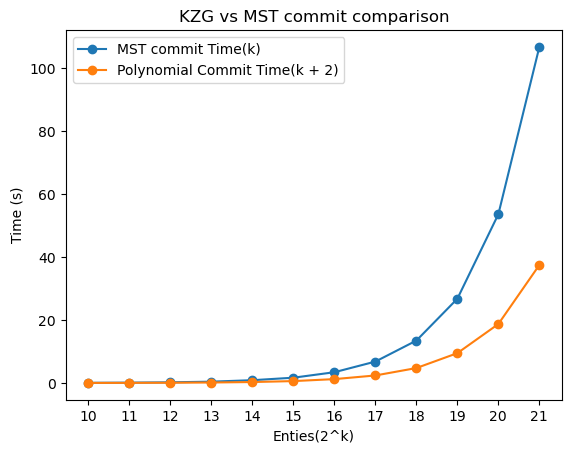

# Comparative Performance Analysis of Merkle Sum Tree and KZG Polynomial Commitments

This repository contains the implementation and performance analysis of the Merkle Sum Tree (MST) and KZG Polynomial Commitments.

## Test Results

The primary focus of this repository is to compare the performance of MST and KZG Polynomial Commitments. 

For our tests, we utilized the same data files that are also available in the Summa-solvency repository. You can find these files [here](https://github.com/summa-dev/summa-solvency/tree/master/zk_prover#benches).

The results of our tests are as follows:



Note: We adjusted the value for the K factor upwards when evaluating polynomial commitments in comparison to MST. This is because in MST, actions such as evaluating commits, obtaining the root hash, or increasing the number of assets don't significantly impact performance. 
 However, in polynomial commitments, the degree of the polynomial increases directly in proportion to the added number of assets.

 For this test case, since we worked with two assets, the polynomial commitment was adjusted to $K + 2$.

| Entries(2^k)  |   MST commit time(s) |   Polynomial Commit time(s) |   Performance Ratio (MST/Poly) |
|---:|------------------:|-------------------------:|----------:|
| 10 |          0.704    |                 0.261    |  x2.692   |
| 11 |          1.382    |                 0.511    |  x2.703   |
| 12 |          2.752    |                 1.011    |  x2.722   |
| 13 |          5.556    |                 2.044    |  x2.718   |
| 14 |         11.074    |                 3.963    |  x2.794   |
| 15 |         22.015    |                 7.923    |  x2.778   |
| 16 |         44.049    |                15.692    |  x2.807   |
| 17 |         88.211    |                31.043    |  x2.841   |
| 18 |        176.363    |                61.961    |  x2.846   |
| 19 |        352.468    |               123.681    |  x2.849   |
| 20 |        704.646    |               245.971    |  x2.864   |
| 21 |       1408.12     |               490.199    |  x2.872   |

Run on AMD 5950X, 64GB RAM, 16 cores.

It's worth noting that the codebase used for evaluating the MST is housed within the Summa repository. In contrast, the KZG polynomial commitment evaluation code is located within the halo2 repository.

### How to run the tests

For those interested in running the tests, we provide a collection of dummy usernames and balance entries, formatted as CSV files. 

Instructions for downloading and using these CSV files are as follows:

```bash
> mkdir -p src/csv
> cd src/csv 
wget https://summa-solvency.s3.eu-central-1.amazonaws.com/csv_files.tar.bz2
tar -xjf csv_files.tar.bz2
```

You can also run on your local machine:

```bash
> cargo run --bin comparing-mst-kzg
```

## Testing KZG commitment on KZGCircuit
 
 We conducted tests by evaluating a commit on the KZG commitment polynomial with multiple entries and then generating a proof with the `KZGCircuit`. 
 
 This circuit is developed by Punwai and can be found [here](https://github.com/punwai/halo2-lib/tree/kzg).

### Test Result

For this test, we utilized only 16 entries from the file `src/csv/entry_16.csv`.

However, the circuit demands a substantial number of rows to generate a proof.

| Task                   | Duration        |
|------------------------|----------------:|
| Loading user data      |  44.950ms       |
| Evaluating commitment  | 439.141ms       |
| Generating vkey        |  141.388s       |
| Generating pkey        |   61.444s       |
| Proving time           |  241.209s       |

Additional Information:
- Gate Chip | Phase 0: 7474506 advice cells, 990516 lookup advice cells
- Total 386 fixed cells
- k: 17, extended_k: 19


### How to Run the test

By default, the code will use the `./src/csv/entry_16.csv` file. You can compile and run the project using the standard commands:

```bash
> cargo run --bin kzg-circuit
```

If you want to test with a larger set $2^{15}$, the `./src/csv/two_assets/two_assets_entry_2_15.csv` file instead, you can enable the large feature when building or running the project:

```bash
> cargo run --bin kzg-circuit --features large-entry
```
